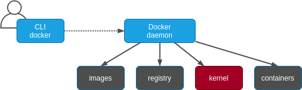
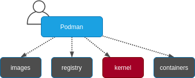

# Solace PubSub+ Event Broker Rootless

Table of Content

- [Solace PubSub+ Event Broker Software on Podman and Docker in Rootless and Non-root Modes](#solace-pubsub-event-broker-software-on-podman-and-docker-in-rootless-and-non-root-modes)
	- [0 - Installation](#0---installation)
		- [Podman](#podman)
		- [Docker](#docker)
	- [1 - The Audit Log and Login User UID](#1---the-audit-log-and-login-user-uid)
	- [2 - How Docker Works](#2---how-docker-works)
	- [3 - How Podman Compares With Docker](#3---how-podman-compares-with-docker)
	- [4 - Example Postgres in Rootless Mode](#4---example-postgres-in-rootless-mode)
	- [5 - Running Solace PubSub+ Event Broker Software on Podman and Docker](#5---running-solace-pubsub-event-broker-software-on-podman-and-docker)
		- [Test Cases](#test-cases)
		- [PubSub+ on Podman](#pubsub-on-podman)
		- [PubSub+ on Docker](#pubsub-on-docker)
	- [6 - Verify PubSub+ Software](#6---verify-pubsub-software)
	- [7 - Notes](#7---notes)
	- [8 - Conclusion](#8---conclusion)

[Docker] takes the `client/server` approach for developing, managing and running containers. It has a build time and run time daemon, `dockerd` which needs to be started with root privileges. It uses a commandline API client `docker` to handle all communications with the daemon.

[Podman] is a daemonless container engine. It is a drop-in replacement for Docker, such that `alias docker=podman` works just fine. Podman runs OCI containers as root or `rootless` user. Podman adopted a `folk/exec` container runtime pattern for managing and running containers. It has its own set of add-value features for Kubernetes and OpenShift.

Solace customers have been asking to run PubSub+ containers rootless with Podman. This how-to aims to evaluate this and compare Podman with Docker  from a container namespace security view point. Docker recently introduced `rootless` as an experimental feature in v19.03.

## 0 - Installation

We will use two Ubuntu 18.04 LTS machines called `podman` and `docker`, respectively. Start yours whichever may is convenient. We use [multipass] to launch the VMs.

### Podman

See [Podman] documentation for information on how to install Podman for your OS.

```bash
# create VM
multipass launch -n podman -c 2 -m 2G -d 50G
multipass shell podman

ubuntu@podman:~  sudo apt update && sudo apt upgrade -y
ubuntu@podman:~ . /etc/os-release
```

Install Podman.

```bash
# copy and paste below (between both EOF lines) on the command line
ubuntu@podman:~ cat << EOF > install_podman.sh
#!/usr/bin/env bash

set -a
sudo sh -c "echo 'deb http://download.opensuse.org/repositories/devel:/kubic:/libcontainers:/stable/x${NAME}_${VERSION_ID}/ /' > /etc/apt/sources.list.d/devel:kubic:libcontainers:stable.list"
wget -nv https://download.opensuse.org/repositories/devel:kubic:libcontainers:stable/x${NAME}_${VERSION_ID}/Release.key -O Release.key
sudo apt-key add - < Release.key
sudo apt-get update -qq
sudo apt-get -qq -y install podman
sudo mkdir -p /etc/containers
echo -e "[registries.search]\nregistries = ['docker.io', 'quay.io']" | sudo tee /etc/containers/registries.conf
set +a
EOF
ubuntu@podman:~ chmod +x install_podman.sh
ubuntu@podman:~ ./install_podman.sh
```

For root-less podman to work, there are additional actions:

```bash
# Setup CNI that can be launched by non-root user
ubuntu@podman:~ sudo apt install slirp4netns

# edit /etc/subuid and /etc/subgid
ubuntu@podman:~ grep ubuntu /etc/subuid
/etc/subuid:ubuntu:1000000:65536
ubuntu@podman:~ grep ubuntu /etc/subgid
/etc/subgid:ubuntu:1000000:65536
# activate
ubuntu@podman:~ podman system migrate
ubuntu@podman:~ podman unshare cat /proc/self/uid_map
```

### Docker

You will install Docker v19.03+. Since `rootless` is currently experimental, we need separate approaches for installing standard docker and rootless flavors.

```bash
# create VM
multipass launch -n docker -c 2 -m 2G -d 50G
multipass shell docker

ubuntu@docker:~  sudo apt update && sudo apt upgrade -y
ubuntu@docker:~ . /etc/os-release
```

Install Docker.

**Rootful Docker** - Docker daemon runs as root.

```bash
# install Docker
ubuntu@docker:~$ sudo apt-get update
ubuntu@docker:~$ sudo apt-get install apt-transport-https ca-certificates curl    gnupg-agent software-properties-common
ubuntu@docker:~$ curl -fsSL https://download.docker.com/linux/ubuntu/gpg | sudo apt-key add -
ubuntu@docker:~$ sudo add-apt-repository "deb [arch=amd64] https://download.docker.com/linux/ubuntu $(lsb_release -cs) stable"
ubuntu@docker:~$ sudo apt-get update
ubuntu@docker:~$ sudo apt-get install docker-ce docker-ce-cli containerd.io
```

To avoid typing `sudo`, add your user to the `docker` group. Note: Docker daemon still runs as root.

```bash
ubuntu@docker:~$ sudo usermod -aG docker ubuntu
newgrp docker # or log out and log back in
```

**Rootless Docker** - Docker daemon runs as non-privileged user.

Unlike, `userns-remap` mode where the daemon itself is running with root provileges, in rootless mode, both the daemon and the container are running without root privileges.

Remove existing docker instances.

```bash
ubuntu@docker:~$ sudo apt-get remove docker docker-engine docker.io containerd runc
ubuntu@docker:~$ sudo apt-get purge docker-ce
ubuntu@docker:~$ sudo rm -rf /var/lib/docker
```

Install Docker.

```bash
ubuntu@docker:~$ curl -fsSL https://get.docker.com/rootless | sh

ubuntu@docker:~$ cat << EOF >> ~/.bashrc
export PATH=/home/ubuntu/bin:$PATH
export DOCKER_HOST=unix:///run/user/1000/docker.sock
EOF

ubuntu@docker:~$ source ~/.bashrc
# start dockerd rootless
ubuntu@docker:~$ dockerd-rootless.sh --experimental --storage-driver vfs
```

After testing, you may want to uninstall the still experimental rootless docker.

```bash
ubuntu@docker:~$ systemctl --user stop docker
ubuntu@docker:~$ rm ~/bin/{docker*,rootless*,containerd*,runc,vpnkit,ctr}
ubuntu@docker:~$ rm -rf ~/.local/share/docker
```

## 1 - The Audit Log and Login User UID

We will start by surveying the Linux `audit` tools to help us reason about namespaces. `Audit` allows administrators to watch for security events on a system and have them logged to the `audit.log`.

Example - how to watch `/etc/shadow` file for changes.

```bash
# install auditd if necessary
ubuntu@podman:~ sudo apt install auditd

# watch /etc/shadow
ubuntu@podman:~ sudo auditctl -w /etc/shadow

# now, try to modify the /etc/shadow file
ubuntu@podman:~ touch /etc/shadow

# audit /etc/shadow file
ubuntu@podman:~ ausearch -f /etc/shadow -i -ts recent

...
pid=11605 pid=11996 `auid=ubuntu` uid=ubuntu gid=ubuntu euid=ubuntu suid=ubuntu
...
```

Using `sudo` will not change the user reported by audit as `auid=ubuntu`. The kernel tracks the logged in user through `/proc/self/loginuid`.

```bash
# actual logged in user is tracked in /proc/self/loginuid
ubuntu@podman:~ cat /proc/self/loginuid
1000

# become root, my login UID stays the same
ubuntu@podman:~ sudo cat /proc/self/loginuid
1000
```

We will use similar checks like above to see what Podman or Docker is doing with running processes on the host and in container namespaces thoughout these tests.

## 2 - How Docker Works

Docker daemon provides the functionality needed to:

- Pull and push images from an image registry.
- Make copies of images in a local container storage and to add layers to those containers.
- Commit containers and remove local container images from the host repository.
- Ask the kernel to run a container with the right namespace and cgroup, etc.



The Docker daemon does all the work with registries, images, containers, and the kernel. The Docker command-line interface (CLI) is an API client UI.

Concerns about the Docker `client/server` approach:

- A single process could be a single point of failure, the Docker daemon process owns all the child processes (the running containers).
- If a failure occurred, then there were orphaned processes.
- Building containers with the same daemon that runs containers leads to security vulnerabilities.
- All Docker operations have to be conducted by a user (or users) with full root access.

## 3 - How Podman Compares With Docker

- You install Podman instead of Docker.
- You do not need to start or manage a daemon process.
- Docker work the same for Podman.
- Podman stores its containers and images in one place `~/.local/share/containers/storage`.
- Podman and Docker images are compatible, so existing Docker images work with Podman.
- Podman does more than Docker for Kubernetes environments.
- Unlioke Docker, Podman separates concerns, it uses [Buildah] for builds.



## 4 - Example Postgres in Rootless Mode

Databases run traditionally as non-root user. We will do a quick podman test of Postgres running as `postgres` user.

```bash
ubuntu@podman:~$ podman pull postgres
ubuntu@podman:~$ mkdir ~/html
ubuntu@podman:~$ podman run -it **-v "$PWD"/html:/output:Z** schemaspy/schemaspy:snapshot -u postgres -t pgsql11 -host 192.168.4.1 -port 5432 -db testdb
ubuntu@podman:~$ podman run -it --rm --name my-postgres \
-e POSTGRES_USER=postgres \
-e POSTGRES_PASSWORD=mysecret \
-e POSTGRES_DB=testdb \
-p 5432:5432 -v "$PWD"/html:/output:Z postgres
# Error!
```

Generates an error. Let's chown the `$PWD/html` directory to match the UID that Postgresql runs with inside the container. Where to do this? Container or host? Which uid/gid to use?

```bash
# inside the container
\# grep postgres /etc/passwd
postgres:x:26:26:PostgreSQL Server:/var/lib/pgsql:/bin/bash
```

Use `podman unshare` to drop into the mapped user namespace of the container as defined in `/etc/subuid` and `/etc/subgid`.

```bash
# on the host
ubuntu@podman:~$ podman unshare cat /proc/self/uid_map
	0    1000      1
	1    1000000    65536
```

This result shows that UID=0 is mapped to `ubuntu` UID=1000, while UID=1 is mapped to 1000000, UID=2 is mapped to 1000001, and so on. This result means that UID 26 inside the container runs as UID 1000025 on the host.

Therefore, let's try this...

```bash
# on the host
ubuntu@podman:~$ chown 1000025:1000025 $PWD/html
# Error!
```

Still doesn't work. The problem is that even though the user account can run in a user namespace with these mappings, user `ubuntu` does not currently exist in a user namespace.

Let's use `podman unshare` to drop into the container user namespace.

```bash
# on the host
ubuntu@podman:~$ podman unshare chown 1000025:1000025 $PWD/html
# Error!
```

A different error. The issue now is that the chown is happening inside the user namespace. `chown` needs to use the original UID, not the mapped UID:

```bash
# on the host
ubuntu@podman:~$ podman unshare chown 26:26 $PWD/html
ubuntu@podman:~$ ls -ld $PWD/html
drwxrwxr-x. 2 1000025 1000025 4096 Sep 13 07:14 /home/ubuntu/html
ubuntu@podman:~$ ps faxo "uname,pid,args" | grep "postgres"
# finally, it works!
```

Take some time to analyze this example!

**Does running `rootless` Podman as `non-root` make sense?**

If you are already running the container as `rootless`, why should you run Postgresql as a different `non-root` in the container?

1. `Rootless` runs as root UID=0 inside the container.
2. `root` user inside the container is mapped to `ubuntu` UID=1000 on the host.
3. If the container process escapes the container, the process would have full access to `ubuntu` home directory, `~/.ssh` and `~/.gpg` on the host, but nothing else.
4. You run postgres as `postgres` UID with non-root access in the container.
5. To let `postgres` UID work with local files, ex `~/html`, use `podman unshare` command as shown above or add `postgres` to the `root` group.

## 5 - Running Solace PubSub+ Event Broker Software on Podman and Docker

Earlier PubSub+ did not support `rootless` for several reasons including `sshd` requires root to allow restricted ports (80, 443 and 943) to work.

PubSub+ v9.4+ supports `rootless`. Restricted ports have been replaced with non-ephemeral ports (above 1024):

| From | To   | Purpose                |
| ---- | ---- | ---------------------- |
| 80   | 8008 | web transport          |
| 443  | 1443 | web transport over TLS |
| 943  | 1943 | SEMP over TLS          |

On initialization, if an arbitrary non-root container user is not specified on the commandline with `--user=UID`, a default user UID=1000001 is assigned. SSH will run as this container user.

### Test Cases

We will investigate running PS+ on Podman and Docker using the following test cases.

<table>
	<thead>Table: Test Cases</thead>
	<tr>
		<th></th>
		<th align="center">#</th>
		<th align="center">rootless<br>(host)</th>
		<th align="center">non-root<br>(container)</th>
		<th align="center">command</th>
	</tr>
	<tr>
		<th align="left">Podman</th>
		<td>1</td>
		<td align="center">no</td>
		<td align="center">no</td>
		<td align="left">sudo podman run -d -p 8080:8080 -p 55555:55555 --shm-size=2g --env username_admin_globalaccesslevel=admin --env username_admin_password=admin --name=solace solace/solace-pubsub-standard</td>
	</tr>
	<tr>
		<th align="left">Podman</th>
		<td>2</td>
		<td align="center">no</td>
		<td align="center">yes</td>
		<td align="left">sudo podman run -d -p 8080:8080 -p 55555:55555 --user 30:30 --shm-size=2g --env username_admin_globalaccesslevel=admin --env username_admin_password=admin --name=solace solace/solace-pubsub-standard</td>
	</tr>
	<tr>
		<th align="left">Podman</th>
		<td>3</td>
		<td align="center">yes</td>
		<td align="center">no</td>
		<td align="left">podman run -d -p 8080:8080 -p 55555:55555 --shm-size=2g --env username_admin_globalaccesslevel=admin --env username_admin_password=admin --name=solace solace/solace-pubsub-standard</td>
	</tr>
	<tr>
		<th align="left">Podman</th>
		<td>4</td>
		<td align="center">yes</td>
		<td align="center">yes</td>
		<td align="left">podman run -d -p 8080:8080 -p 55555:55555 --user 30:30 --shm-size=2g --env username_admin_globalaccesslevel=admin --env username_admin_password=admin --name=solace solace/solace-pubsub-standard</td>
	</tr>
	<tr>
		<th align="left">Docker</th>
		<td>5</td>
		<td align="center">no</td>
		<td align="center">no</td>
		<td align="left">sudo docker run -d -p 8080:8080 -p 55555:55555 --shm-size=2g --env username_admin_globalaccesslevel=admin --env username_admin_password=admin --name=solace solace/solace-pubsub-standard</td>
	</tr>
	<tr>
		<th align="left">Docker</th>
		<td>6</td>
		<td align="center">no</td>
		<td align="center">yes</td>
		<td align="left">sudo docker run -d -p 8080:8080 -p 55555:55555 --user 30:30 --shm-size=2g --env username_admin_globalaccesslevel=admin --env username_admin_password=admin --name=solace solace/solace-pubsub-standard</td>
	</tr>
	<tr>
		<th align="left">Docker</th>
		<td>7</td>
		<td align="center">yes</td>
		<td align="center">no</td>
		<td align="left">docker run -d -p 8080:8080 -p 55555:55555 --shm-size=2g --env username_admin_globalaccesslevel=admin --env username_admin_password=admin --name=solace solace/solace-pubsub-standard</td>
	</tr>
	<tr>
		<th align="left">Docker</th>
		<td>8</td>
		<td align="center">yes</td>
		<td align="center">yes</td>
		<td align="left">docker run -d -p 8080:8080 -p 55555:55555 --user 30:30 --shm-size=2g --env username_admin_globalaccesslevel=admin --env username_admin_password=admin --name=solace solace/solace-pubsub-standard</td>
	</tr>
</table>

### PubSub+ on Podman

```bash
# check setuid map
ubuntu@podman:~$ cat /etc/subuid
ubuntu:1000000:65536
```

1. Podman runs as root, non-root user option is not set. Solace sets default UID=1000001.

```bash
ubuntu@podman:~$ sudo podman run -d -p 8080:8080 -p 55555:55555 --shm-size=2g --env username_admin_globalaccesslevel=admin --env username_admin_password=admin --name=solace solace/solace-pubsub-standard
# It works! See notes below.
```

```bash
# audit logged in user
ubuntu@podman:~$ sudo podman exec solace cat /proc/self/loginuid
1000
# container logged in user is ubuntu
```

```bash
# solace sets default ui=1000001 in the container
ubuntu@podman:~$ sudo podman exec solace id
uid=1000001(1000001) gid=0(root) groups=0(root)
```

```bash
# solaces processes run as uid=1000001 in the default namespace on the host
ubuntu@podman:~$ ps faxo "uname,pid,args" |grep solace
1000001  17369  \_ /usr/sw/loads/soltr_9.4.0.78/bin/solacedaemon --vmr -z -f /var/lib/solace/config/SolaceStartup.txt -r -1
1000001  17840      \_ nginx: master process nginx -c /var/lib/solace/config/nginx.conf -g pid /var/run/solace/nginx.pid;
1000001  17859      \_ /sbin/rsyslogd -n -i /var/run/solace/rsyslogd.pid
```

```bash
# solace processes run in the uid=1000001 namespace in the container
ubuntu@podman:~$ sudo podman top solace
USER      PID   PPID   %CPU    ELAPSED           TTY   TIME   COMMAND
1000001   1     0      0.000   9m33.343078429s   ?     0s     /usr/sw/loads/soltr_9.4.0.78/bin/solacedaemon --vmr -z -f /var/lib/solace/config/SolaceStartup.txt -r -1 
1000001   220   1      0.355   9m23.343130943s   ?     2s     python /usr/sw/loads/soltr_9.4.0.78/scripts/vmr-solaudit -d 
1000001   270   1      0.000   9m15.343164327s   ?     0s     /usr/sw/loads/soltr_9.4.0.78/bin/watchdog -w 0 -R 900 
... omitted remaining lines
```

```bash
# network interfaces. Uses host CNI. Can only be configured by running as root
ubuntu@podman:~$ ifconfig
cni-podman0: flags=4163<UP,BROADCAST,RUNNING,MULTICAST>  mtu 1500
        inet 10.88.0.1  netmask 255.255.0.0  broadcast 10.88.255.255
        inet6 fe80::70fe:c8ff:feb4:c2dd  prefixlen 64  scopeid 0x20<link>
        ether 72:fe:c8:b4:c2:dd  txqueuelen 1000  (Ethernet)
        RX packets 1443  bytes 661285 (661.2 KB)
        RX errors 0  dropped 0  overruns 0  frame 0
        TX packets 1440  bytes 662550 (662.5 KB)
        TX errors 0  dropped 0 overruns 0  carrier 0  collisions 0

ens3: flags=4163<UP,BROADCAST,RUNNING,MULTICAST>  mtu 1500
        inet 192.168.122.86  netmask 255.255.255.0  broadcast 192.168.122.255
        inet6 fe80::5054:ff:fed6:2c57  prefixlen 64  scopeid 0x20<link>
        ether 52:54:00:d6:2c:57  txqueuelen 1000  (Ethernet)
        RX packets 120570  bytes 693057861 (693.0 MB)
        RX errors 0  dropped 26394  overruns 0  frame 0
        TX packets 44387  bytes 5923964 (5.9 MB)
        TX errors 0  dropped 0 overruns 0  carrier 0  collisions 0

lo: flags=73<UP,LOOPBACK,RUNNING>  mtu 65536
        inet 127.0.0.1  netmask 255.0.0.0
        inet6 ::1  prefixlen 128  scopeid 0x10<host>
        loop  txqueuelen 1000  (Local Loopback)
        RX packets 424  bytes 39086 (39.0 KB)
        RX errors 0  dropped 0  overruns 0  frame 0
        TX packets 424  bytes 39086 (39.0 KB)
        TX errors 0  dropped 0 overruns 0  carrier 0  collisions 0

veth84007e1d: flags=4163<UP,BROADCAST,RUNNING,MULTICAST>  mtu 1500
        inet6 fe80::8086:40ff:fe20:8bec  prefixlen 64  scopeid 0x20<link>
        ether 82:86:40:20:8b:ec  txqueuelen 0  (Ethernet)
        RX packets 680  bytes 318990 (318.9 KB)
        RX errors 0  dropped 0  overruns 0  frame 0
        TX packets 682  bytes 312224 (312.2 KB)
        TX errors 0  dropped 0 overruns 0  carrier 0  collisions 0
```

2. Podman runs as root and non-root user option UID=30 is set.

```bash
ubuntu@podman:~$ sudo podman run -d -p 8080:8080 -p 55555:55555 --user 30:30 --shm-size=2g --env username_admin_globalaccesslevel=admin --env username_admin_password=admin --name=solace solace/solace-pubsub-standard
# Works! See notes below.
```

```bash
# audit check logged in user - unset by podman
ubuntu@podman:~$ sudo podman exec solace cat /proc/self/loginuid
1000
# logged in user is ubuntu
```

```bash
# solace sets ui=30 in the container
ubuntu@podman:~$ sudo podman exec solace id
uid=30(30) gid=30(appgrp) groups=30(appgrp)
```

```bash
# solaces processes run in the uid=30 unallocated namespace on the host. Insecure.
ubuntu@podman:~$ ps faxo "uname,pid,args" |grep solace
30        5127  \_ /usr/sw/loads/soltr_9.4.0.78/bin/solacedaemon --vmr -z -f /var/lib/solace/config/SolaceStartup.txt -r -1
30        5636      \_ nginx: master process nginx -c /var/lib/solace/config/nginx.conf -g pid /var/run/solace/nginx.pid;
30        5655      \_ /sbin/rsyslogd -n -i /var/run/solace/rsyslogd.pid
```

```bash
# solace processes run in the uid=30 namespace in the container
buntu@podman:~$ sudo podman top solace                                                                  
USER   PID   PPID   %CPU     ELAPSED           TTY   TIME    COMMAND                                     
30     1     0      0.000    9m21.035116182s   ?     0s      /usr/sw/loads/soltr_9.4.0.78/bin/solacedaemon --vmr -z -f /var/lib/solace/config/SolaceStartup.txt -r -1
30     218   1      0.364    9m10.03515767s    ?     2s      python /usr/sw/loads/soltr_9.4.0.78/scripts/vmr-solaudit -d
30     268   1      0.000    9m3.03520158s     ?     0s      /usr/sw/loads/soltr_9.4.0.78/bin/watchdog -w 0 -R 900  
... omitted remaining lines
```

3. Podman runs rootless and non-root user is not set. Solace sets default UID=1000001

```bash
ubuntu@podman:~$ podman run -d -p 8080:8080 -p 55555:55555 --shm-size=2g --env username_admin_globalaccesslevel=admin --env username_admin_password=admin --name=solace solace/solace-pubsub-standard
# Error! See notes below.
```

4. Podman runs rootless and non-root user is set.

```bash
ubuntu@podman:~$ podman run -d -p 8080:8080 -p 55555:55555 --user 30:30 --shm-size=2g --env username_admin_globalaccesslevel=admin --env username_admin_password=admin --name=solace solace/solace-pubsub-standard
# Works! See notes below.
```

```bash
# audit check logged in user
ubuntu@podman:~$ podman exec solace cat /proc/self/loginuid
0
# logged in user is root
```

```bash
# solace set uid=30 in the container
ubuntu@podman:~$ sudo podman exec solace id
uid=30(30) gid=30(appgrp) groups=30(appgrp)
```

```bash
# solaces processes run as uid=1000029 in the allocated namespace on the host. Secure.
ubuntu@podman:~$ ps faxo "uname,pid,args" |grep solace
1000029   6468  \_ /usr/sw/loads/soltr_9.4.0.78/bin/solacedaemon --vmr -z -f /var/lib/solace/config/SolaceStartup.txt -r -1
1000029   6952      \_ nginx: master process nginx -c /var/lib/solace/config/nginx.conf -g pid /var/run/solace/nginx.pid;
1000029   6971      \_ /sbin/rsyslogd -n -i /var/run/solace/rsyslogd.pid
```

```bash
# solace processes run as uid=30 in the container
ubuntu@podman:~$ sudo podman top solace
USER   PID   PPID   %CPU     ELAPSED           TTY   TIME    COMMAND
30     1     0      0.000    9m21.035116182s   ?     0s      /usr/sw/loads/soltr_9.4.0.78/bin/solacedaemon --vmr -z -f /var/lib/solace/config/SolaceStartup.txt -r -1
30     218   1      0.364    9m10.03515767s    ?     2s      python /usr/sw/loads/soltr_9.4.0.78/scripts/vmr-solaudit -d
30     268   1      0.000    9m3.03520158s     ?     0s      /usr/sw/loads/soltr_9.4.0.78/bin/watchdog -w 0 -R 900
... omitted remaining lines
```

### PubSub+ on Docker

```bash
# check setuid map
ubuntu@docker:~$ cat /etc/subuid
ubuntu:1000000:65536
```

5. Docker runs as root, non-root user is not set. Solace sets default UID=1000001

```bash
ubuntu@docker:~$ sudo docker run -d -p 8080:8080 -p 55555:55555 --shm-size=2g --env username_admin_globalaccesslevel=admin --env username_admin_password=admin --name=solace solace/solace-pubsub-standard
# Works!
```

```bash
# audit check logged in user. uid=4294967295 means login uid is not set.
sudo docker exec solace cat /proc/self/loginuid
4294967295
```

```bash
# solace sets default ui=1000001 in the container
ubuntu@docker:~$ sudo docker exec solace id
uid=1000001(appuser) gid=0(root) groups=0(root)
```

```bash
# solaces processes run as uid=1000001 in the default namespace on the host
ubuntu@docker:~$ ps faxo "uname,pid,args" | grep solace
1000001   4634      \_ /usr/sw/loads/soltr_9.4.0.78/bin/solacedaemon --vmr -z -f /var/lib/solace/config/SolaceStartup.txt -r -1
1000001   5228          \_ nginx: master process nginx -c /var/lib/solace/config/nginx.conf -g pid /var/run/solace/nginx.pid;
1000001   5247          \_ /sbin/rsyslogd -n -i /var/run/solace/rsyslogd.pid
```

```bash
# solace processes run in the uid=1000001 namespace in the container
ubuntu@docker:~$ sudo docker top solace
UID       PID   PPID     C    STIMETTY   TIME       CMD         
1000001   4634  4608     0    22:09?     00:00:00   /usr/sw/loads/soltr_9.4.0.78/bin/solacedaemon --vmr -z -f /var/lib/solace/config/SolaceStartup.txt -r -1$        
1000001   4906  4634     0    22:09?     00:00:06   python /usr/sw/loads/soltr_9.4.0.78/scripts/vmr-solaudit -d
1000001   5045  4634     0    22:09?     00:00:00   /usr/sw/loads/soltr_9.4.0.78/bin/watchdog -w 0 -R 900
1000001   5046  4634     0    22:09?     00:00:00   /usr/sw/loads/soltr_9.4.0.78/bin/cmdserver
... omitted remaining lines
```

6. Docker runs as root and non-root user is set.

```bash
ubuntu@podman:~$ sudo docker run -d -p 8080:8080 -p 55555:55555 --user 30:30 --shm-size=2g --env username_admin_globalaccesslevel=admin --env username_admin_password=admin --name=solace solace/solace-pubsub-standard
# Works! See notes below.
```

```bash
# audit check logged in user. uid=4294967295 means login uid is not set.
ubuntu@docker:~$ sudo docker exec solace cat /proc/self/loginuid
4294967295
```

```bash
# solace sets ui=30 in the container
ubuntu@docker:~$ sudo docker exec solace id
uid=30(30) gid=30(appgrp) groups=30(appgrp)
```

```bash
# solaces processes run in the uid=30 unallocated namespace on the host. Insecure.
ubuntu@docker:~$ ps faxo "uname,pid,args" |grep solace
30        6170      \_ /usr/sw/loads/soltr_9.4.0.78/bin/solacedaemon --vmr -z -f /var/lib/solace/config/SolaceStartup.txt -r -1
30        6690          \_ nginx: master process nginx -c /var/lib/solace/config/nginx.conf -g pid /var/run/solace/nginx.pid;
30        6709          \_ /sbin/rsyslogd -n -i /var/run/solace/rsyslogd.pid
```

```bash
# solace processes run in the uid=30 namespace in the container
ubuntu@docker:~$ sudo docker top solace
UID                 PID                 PPID                C                   STIME               TTY               TIME                CMD
30                  6170                6145                0                   22:58               ?                 00:00:00            /usr/sw/loads/soltr_9.4.0.78/bin/solacedaemon --vmr -z -f /var/lib/sol
ace/config/SolaceStartup.txt -r -1
30                  6440                6170                0                   22:58               ?                 00:00:00            python /usr/sw/loads/soltr_9.4.0.78/scripts/vmr-solaudit -d
30                  6507                6170                0                   22:58               ?                 00:00:00            /usr/sw/loads/soltr_9.4.0.78/bin/watchdog -w 0 -R 900
30                  6508                6170                0                   22:58               ?                 00:00:00            /usr/sw/loads/soltr_9.4.0.78/bin/cmdserver
... omitted remaining lines
```

7. Docker runs rootless and non-root user is not set. Solace default UID=1000001

Rootless Docker requires the `rootless` v19.03 Docker installed. See instructions above.

```bash
ubuntu@docker:~$ docker run -d -p 8080:8080 -p 55555:55555 --shm-size=2g --env username_admin_globalaccesslevel=admin --env username_admin_password=admin --name=solace solace/solace-pubsub-standard
# Error! See notes below.
```

8. Docker runs rootless and non-root user is set.

```bash
ubuntu@docker:~$ docker run -d -p 8080:8080 -p 55555:55555 --user 30:30 --shm-size=2g --env username_admin_globalaccesslevel=admin --env username_admin_password=admin --name=solace solace/solace-pubsub-standard
# Works! See notes below.
```

```bash
# audit check logged in user - unset by docker
ubuntu@docker:~$ docker exec solace cat /proc/self/uid_map
         0       1000          1
         1    1000000      65536
ubuntu@docker:~$ docker exec solace cat /proc/self/loginuid
0
# logged in user root is mapped to host non-root user
# users 1 - 65536 are mapped from 1000000 and so on...
```

```bash
# solace sets ui=30 in the container
ubuntu@docker:~$ docker exec solace id
uid=30(30) gid=30(appgrp) groups=30(appgrp)
```

```bash
# solaces processes run as uid=1000029 in the allocated namespace on the host. Secure.
ubuntu@docker:~$ ps faxo "uname,pid,args" |grep solace
1000029   8325      |       |       \_ /usr/sw/loads/soltr_9.4.0.78/bin/solacedaemon --vmr -z -f /var/lib/solace/config/SolaceStartup.txt -r -1
1000029   8827      |       |           \_ nginx: master process nginx -c /var/lib/solace/config/nginx.conf -g pid /var/run/solace/nginx.pid;
1000029   8846      |       |           \_ /sbin/rsyslogd -n -i /var/run/solace/rsyslogd.pid
```

```bash
# solace processes. Top does not work!
ubuntu@docker:~$ docker top solace
UID                 PID                 PPID                C                   STIME               TTY                 TIME                CMD
```

```bash
# network interfaces. Does not use host CNI. Therefore, it is configured by non-root user
ubuntu@docker:~$ ifconfig
ens3: flags=4163<UP,BROADCAST,RUNNING,MULTICAST>  mtu 1500
        inet 192.168.122.221  netmask 255.255.255.0  broadcast 192.168.122.255
        inet6 fe80::5054:ff:fe30:5f92  prefixlen 64  scopeid 0x20<link>
        ether 52:54:00:30:5f:92  txqueuelen 1000  (Ethernet)
        RX packets 64669  bytes 598686800 (598.6 MB)
        RX errors 0  dropped 73  overruns 0  frame 0
        TX packets 24079  bytes 3437303 (3.4 MB)
        TX errors 0  dropped 0 overruns 0  carrier 0  collisions 0

lo: flags=73<UP,LOOPBACK,RUNNING>  mtu 65536
        inet 127.0.0.1  netmask 255.0.0.0
        inet6 ::1  prefixlen 128  scopeid 0x10<host>
        loop  txqueuelen 1000  (Local Loopback)
        RX packets 318  bytes 34160 (34.1 KB)
        RX errors 0  dropped 0  overruns 0  frame 0
        TX packets 318  bytes 34160 (34.1 KB)
        TX errors 0  dropped 0 overruns 0  carrier 0  collisions 0
```

## 6 - Verify PubSub+ Software

Minimal verification that the PubSub+ installation works.

**Solace PubSub+ Manager**

Open a browser and enter the url `http://<your-event broker's-ip-address>:8080`. Log in as user `admin` and password `admin`.

Check Solace CLI management tool. Connect to the container image.

```bash
# podman
podman exec -it solace /usr/sw/loads/currentload/bin/cli -A
# docker
docker exec -it solace /usr/sw/loads/currentload/bin/cli -A
# poke around the configuration
solace> enable
solace# config
solace(configure)\#
...other commands...
```

Checkout [Solace CLI Configuration] for additional commands to test your installation.

## 7 - Notes

The results of testing rootful vs rootless on Podman vs Docker are collated in the table below. These tests only looked at how Docker and namespaces Podman handle namespaces and for the user to introspect on what it means to run rootful vs rootless. Bear in mind that Podman was developed to run daemonless and rootless. Docker recently added rootless in v19.03 as an experimental feature.

<table>
	<thead>Table: Results</thead>
	<tr>
		<th></th>
		<th align="center">#</th>
		<th align="center">rootless<br>(host)</th>
		<th align="center">non-root<br>(container)</th>
		<th align="center">result</th>
		<th align="center">loginuid</th>
		<th align="center">appuid</th>
		<th align="center">hostuid</th>
		<th align="center">host<br>networking</th>
	</tr>
	<tr>
		<th align="left">Podman</th>
		<td>1</td>
		<td align="center">no</td>
		<td align="center">no</td>
		<td align="center">pass</td>
		<td align="center">1000</td>
		<td align="center">1000001</td>
		<td align="center">1000001</td>
		<td align="center">yes</td>
	</tr>
	<tr>
		<th align="left">Podman</th>
		<td>2</td>
		<td align="center">no</td>
		<td align="center">yes</td>
		<td align="center">pass</td>
		<td align="center">1000</td>
		<td align="center">30</td>
		<td align="center">30</td>
		<td align="center">yes</td>
	</tr>
	<tr>
		<th align="left">Podman</th>
		<td>3</td>
		<td align="center">yes</td>
		<td align="center">no</td>
		<td align="center">fail</td>
		<td align="center">-</td>
		<td align="center">-</td>
		<td align="center">-</td>
		<td align="center">-</td>
	</tr>
	<tr>
		<th align="left">Podman</th>
		<td>4</td>
		<td align="center">yes</td>
		<td align="center">yes</td>
		<td align="center">pass</td>
		<td align="center">0</td>
		<td align="center">30</td>
		<td align="center">1000029</td>
		<td align="center">no</td>
	</tr>	
	<tr>
		<th align="left">Docker</th>
		<td>5</td>
		<td align="center">no</td>
		<td align="center">no</td>
		<td align="center">pass</td>
		<td align="center">4294967295</td>
		<td align="center">1000001</td>
		<td align="center">1000001</td>
		<td align="center">yes</td>
	</tr>
	<tr>
		<th align="left">Docker</th>
		<td>6</td>
		<td align="center">no</td>
		<td align="center">yes</td>
		<td align="center">pass</td>
		<td align="center">4294967295</td>
		<td align="center">30</td>
		<td align="center">30</td>
		<td align="center">yes</td>
	</tr>
	<tr>
		<th align="left">Docker</th>
		<td>7</td>
		<td align="center">yes</td>
		<td align="center">no</td>
		<td align="center">fail</td>
		<td align="center">-</td>
		<td align="center">-</td>
		<td align="center">-</td>
		<td align="center">-</td>
	</tr>
	<tr>
		<th align="left">Docker</th>
		<td>8</td>
		<td align="center">yes</td>
		<td align="center">yes</td>
		<td align="center">pass</td>
		<td align="center">0</td>
		<td align="center">30</td>
		<td align="center">1000029</td>
		<td align="center">no</td>
	</tr>
</table>

- Podman and Docker results show similarities and minor differences for Solace PubSub+ Docker image.

- The same Podman binary runs `rootful` and `rootless`. Docker v19.03 is the first version to implement `rootless`. A **different binary** needs to be installed in the user's home directory to run docker as `rootless`.

- Table: Result summary
  
  - Items 1 and 5: rootful (`sudo`) and Solace assigned default uid. Podman and Docker containers start up correctly. InPodman and Docker, Solace assigns same UID=1000001 to PS+ processes in the container and on the host. The logged in use `loginuid` is the tracked as the non-root host user, in our case `ubuntu` UID=1000.
  
  - Lines 2 and 6: rootful (`sudo`) and non-root uid. Podman and Docker start up correctly. Both assign UID=30 to Solace PS+ processes in the container and on the host. Note that ruuning as UID=30 on the host is outside the `/etc/setuid` entry which starts at UID=1000000. If UID=30 exists on the host, the container process can reach it and vice versa. Also, there is another security issue:
  
  	Podman has a better security model. In (items 1 and 2), `auditctl` knows the `loginuid` of the logged in user - it is set to UID=1000, the host user `ubuntu`. Docker, on the other hand does not set the `loginuid`, so it defaults to an unknown UID=4294967295 used by several kernel processes such as `systemd` and `init`. Linux `auditctl` reports this transaction as `unset`, or unknown host user (items 5 and 6). This can be exploited to mask a security breach.
	
  - Items 3 and 7: rootless and Solace assigned default uid. Podman and Docker containers fail to start. H\The host's non-root user `ubuntu` does not have permission to set `loginuid` to UID=1000001 (Solace image default UID).

	>Error: container_linux.go:345: starting container process caused "setup user: invalid argument": OCI runtime error
  
  - Items 4 and 8: rootless and non-root uid. Podman and Docker behave the same. `loginuid` UID=0 (root) in the container maps to UID 1000 (ubuntu) on the host. The container `root` has no more permissions on the host than the logged in user `ubuntu`. Surbordinate processes (including Solace `appuser`) have UID 1 - 65536 in the container and UID 1000000 - 1065535 on the host. So, `--user 30:30` means that Solace `appuser` runs as UID 30 in the container and 1000029 on the host.

- `Rootful` Podman and Docker (`sudo`) both use host CNI networking. `Rootless` Podman and Docker require user namespace networking that can be started without root permission such, for example `slirp4netns`. This may pose a performance bottleneck, however it can be swapped out - see [Configuring container networking with Podman] documentation.

## 8 - Conclusion

Podman is gaining popularity as a Docker alternative for managing and running containers daemonless and rootless. It was created by RedHat as opensource and has support for Kubernetes and OpenShift. Docker only recently started to support rootless, still experimental at this point.

When running PubSub+ rootless, set the `--user=UID` flag on the `podman` commandline. If this is not done, Solace with try to assign the default UID=1000001 - this will fail.

Running Podman as usual with `sudo` works as expected. Solace PubSub+ v9.4 processes can run `rootless` on the host and `non-root` in the container. This how-to guide set out to test this and learn what was happening with namespaces under to hood.


[multipass]: https://multipass.run/
[Docker]: https://www.docker.com/
[Podman]: https://podman.io/
[Buildah]: https://github.com/containers/buildah
[Podman can now ease the transition to Kubernetes and CRI-O]: https://developers.redhat.com/blog/2019/01/29/podman-kubernetes-yaml/
[Solace CLI Configuration]: https://docs.solace.com/Configuring-and-Managing/SW-Broker-Specific-Config/Docker-Tasks/Accessing-CLI-from-VMR-Hosts.htm#Accessing-Sol-CLI
[Configuring container networking with Podman]: https://www.redhat.com/sysadmin/container-networking-podman
[Docker 19.03 introduces an experimental rootless...]: https://hub.packtpub.com/docker-19-03-introduces-an-experimental-rootless-docker-mode-that-helps-mitigate-vulnerabilities-by-hardening-the-docker-daemon/
[Experimenting with Rootless Docker]: https://medium.com/@tonistiigi/experimenting-with-rootless-docker-416c9ad8c0d6
